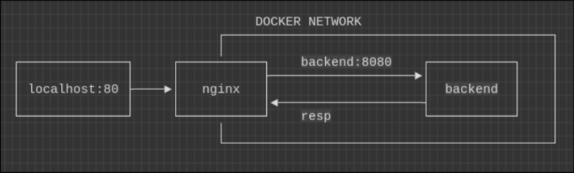

# Effective Mobile – DevOps Test Task

Проект реализован в виде двух Docker-контейнеров, объединённых в одну изолированную сеть Docker Compose:

- backend — минимальный HTTP-сервер на Python, слушает порт 8080;
- nginx — реверс-прокси, слушает порт 80 на хосте и проксирует входящие запросы в backend.

Контейнер backend не публикует порт на хост, поэтому недоступен напрямую извне.
Весь внешний трафик проходит только через nginx.

Nginx использует DNS Docker-сети и обращается к backend по имени сервиса (backend:8080).

Таким образом:

- пользователь видит только nginx;
- backend полностью изолирован внутри сети;
- топология легко масштабируется (можно добавить балансировку, реплики backend и т. д.).

Проект имеет следующую структуру:

.\
├── .img\
│ └── scheme.png # Схема архитектуры для README\
│\
├── backend\
│ ├── Dockerfile # Образ backend-сервиса (Python HTTP server)\
│ └── app.py # Минимальное приложение, отвечает "Hello from Effective Mobile!"\
│\
├── nginx/\
│ └── nginx.conf # Конфигурация nginx с reverse-proxy на backend\
│\
├── docker-compose.yml # Описание сервисов, сети и портов\
├── .env.example # Пример переменных окружения\
├── .gitignore # Игнорируемые файлы для git\
└── README.md # Документация проекта

## Архитектура



- Backend слушает `8080` и доступен только внутри Docker-сети.
- Nginx слушает `80` и проксирует `/` в backend по имени сервиса.

> В этом примере использованы дефолтные порты.

### Минимальные системные требования:

- **Docker** ≥ 20.10
- **Docker Compose** ≥ 2.0 (v2)
- **~1GB RAM**, ~2GB диск

### Используемые образы:

- python:3.12-alpine (backend)
- nginx:1.25-alpine (nginx)

> Зависимостей Python нет! Запускается везде где есть просто докер)

## Использование

### Запуск

1. Скопируйте репозиторий:

```bash
git clone https://<repo-link>.git py-task && cd py-task
```

2. Переопределите **переменные окружения** используя **.env**
   (необязательно, в .env.example стоят дефолтные значения).
3. Поднимите сервисы с помощью **compose**:

```bash
docker compose up -d --build
```

4. Проверьте наличие контейнеров и сети

```bash
docker ps && docker network ls
```

5. Для удаления сервисов выполните:

```bash
docker compose down
```

### Проверка

```bash
curl http://localhost
```

Ожидаемый ответ:

```bash
Hello from Effective Mobile!
```

---

То, что backend доступен только через nginx, можно проверить с помощью:

```bash
curl http://localhost:8080
```

Ожидается `failed to connect after 0 ms`.
